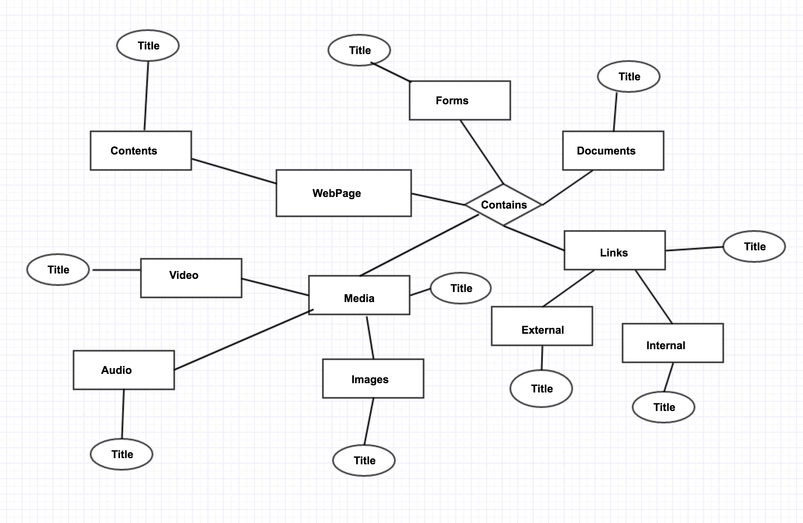
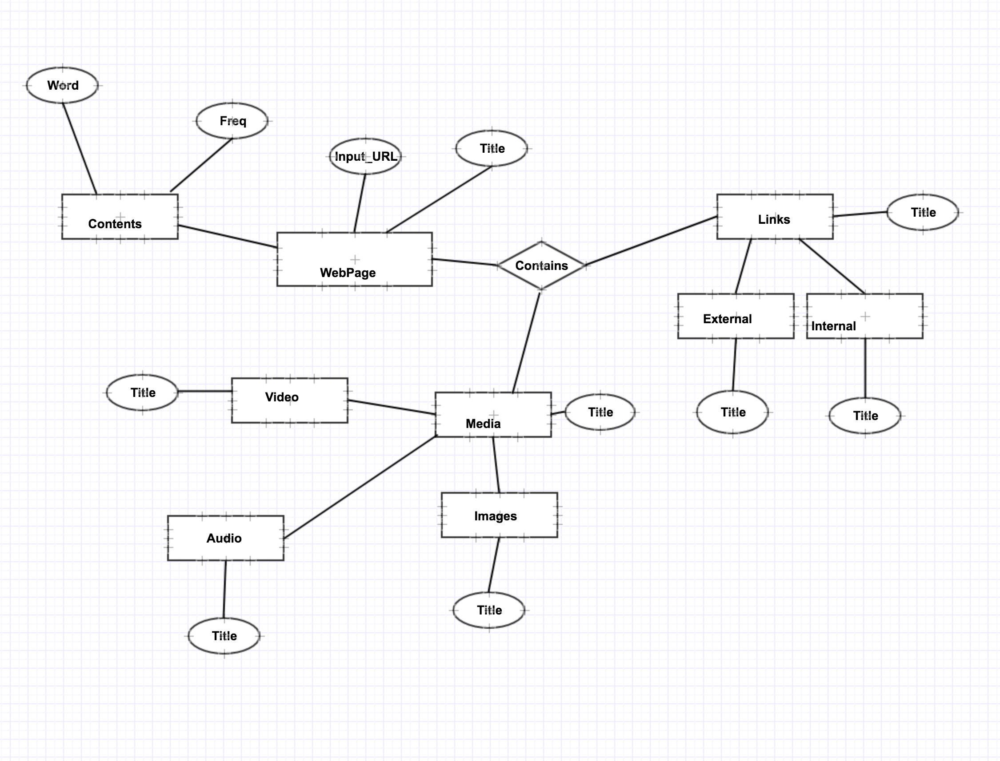
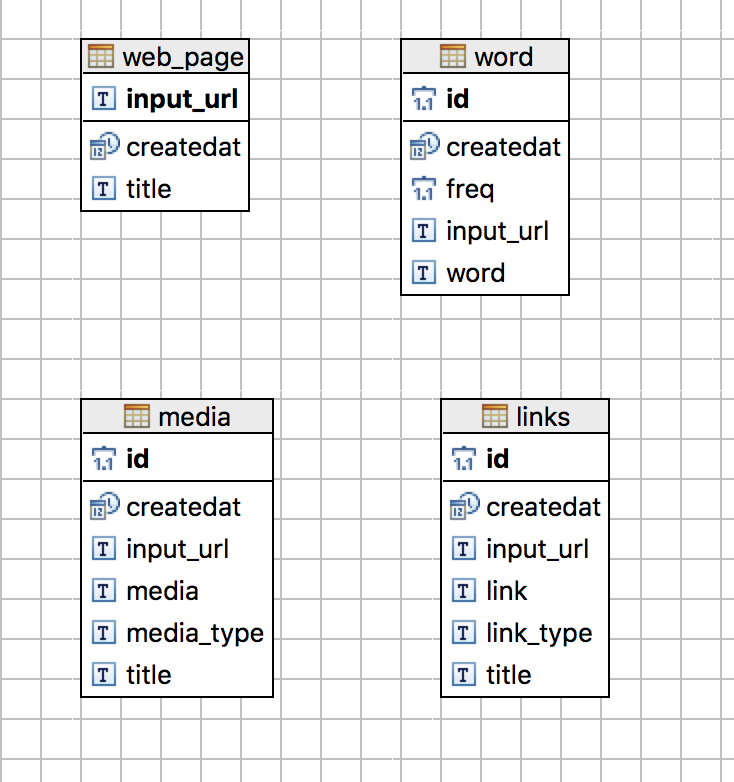
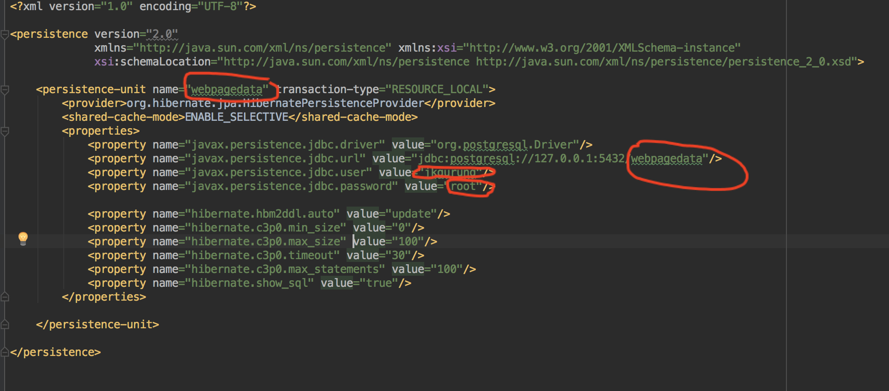
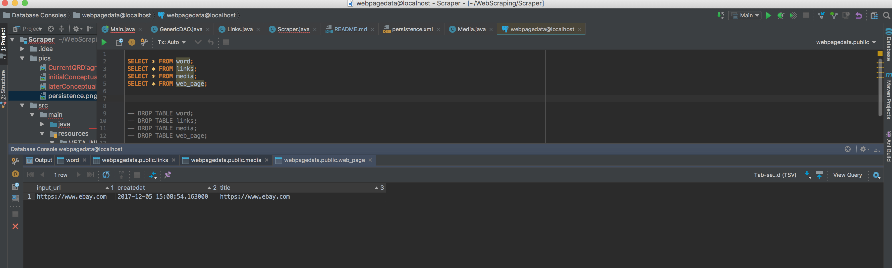
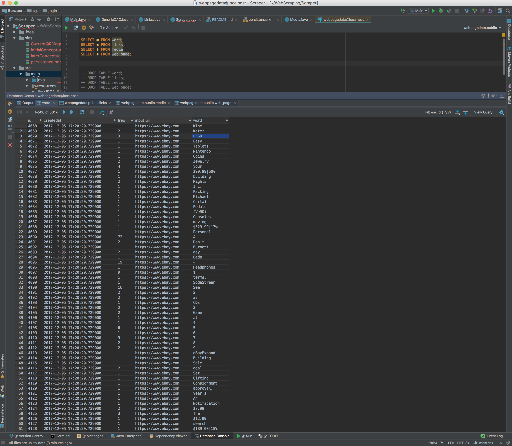
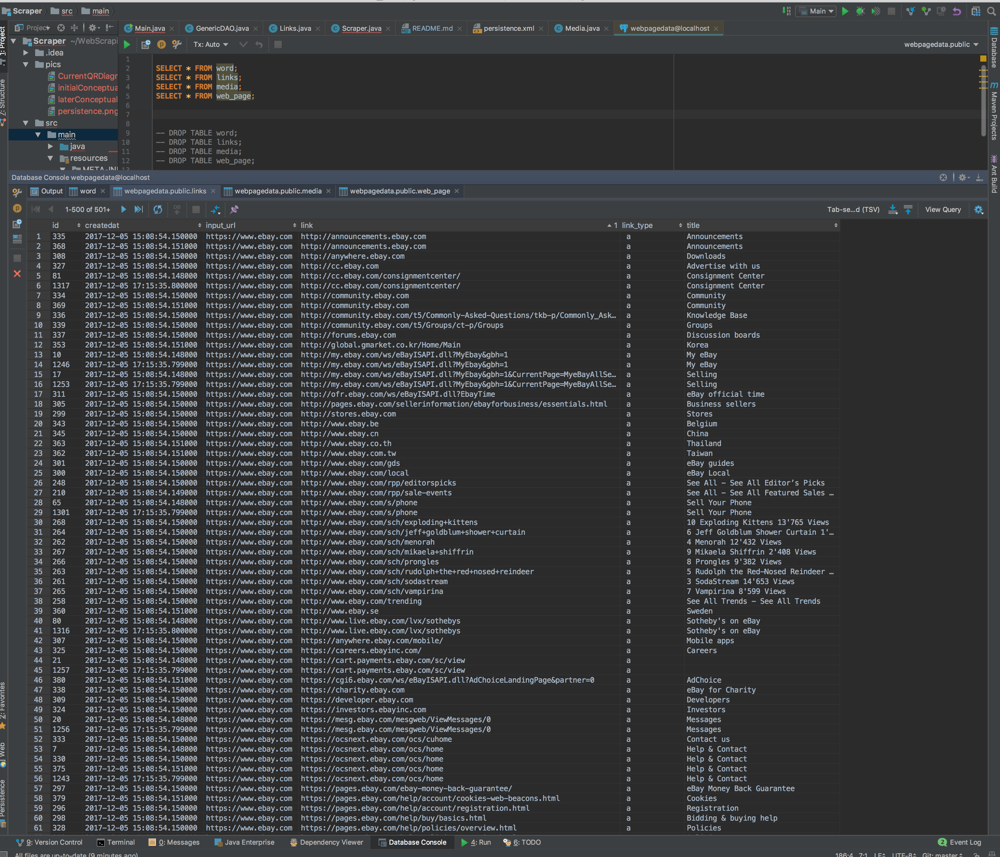
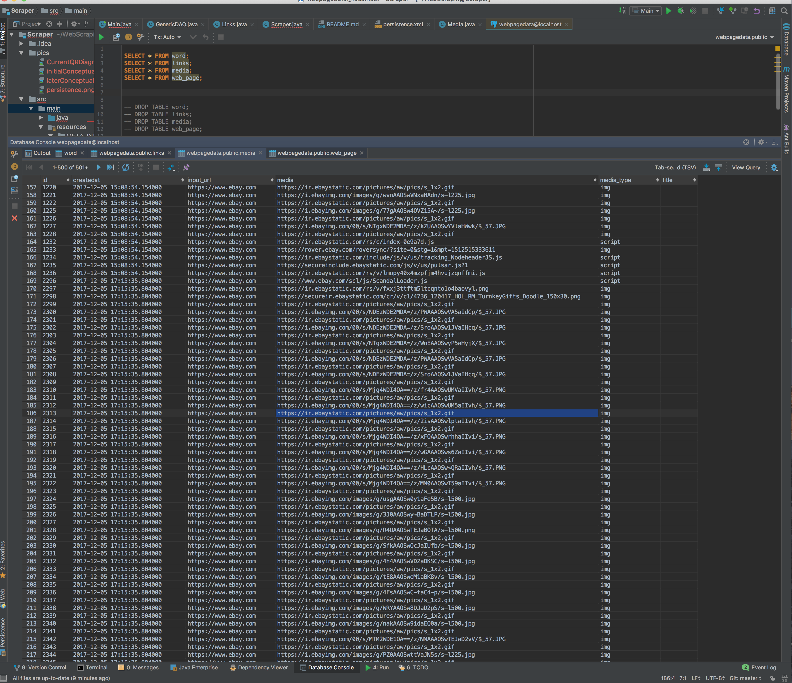

# Scraper
Java application that accepts a URL as input and scrapes the page referenced by the input URL. Filter outs HTML tags and calculates the frequency count of the remaining words. Finally stores the result into PostgreSQL.

---


### Steps Performed

###### 1. Fetch a Webpage from given InputURL.
###### 2. Data Extraction and analysis.
###### 3. Persist the result data to local PostgreSQL server.

-----------------

##### 1. Fetch a Webpage from given InputURL

    I use jsoup a Java library to fetch the webpage referenced by the InputURL. Below is the example code 
    snippet scraping contents from the internet.
    ```
    //send request and retrieve html response
    Document doc = Jsoup.connect(INPUT_URL).ignoreContentType(true).userAgent(USER_AGENT).get();
    ```


##### 2. Data Extraction and analysis

    Onece we have conetent, we need to filter out all the HTML tags. I again use
    jsoup library to grab the desired texts.
    
    Below are the types of data I stored in separate data structure.
    
    
  -   Words: All the words except HTML tags.
      
  -   Links: All the links that was present in this page. This includes external link such as "www.google.com" 
            and internal links such as "#/Contact".
            
  -   Media: This grouped all the media files such as video, audio, etc.


##### 3. Persist the result data to local PostgreSQL server.

    Besides word frequency count, I tried to analyze different elements that's present in the webpage.
    As there's lots of elements in the webpage, it was kinda hard for me to decide what group of elements need 
    to be separate. Therefore, I came up with the conceptual diagram below at the begining. 
    
   
    
    
    After ward, I truncated it to lesser group as below.

   
    
    Below is the current QR diagram.

   


-----------------

#### How to run the program:

1. Create a database on local server. For instance, I created database name `wepagedata` 
in the example below.

```postgresql
CREATE DATABASE webpagedata;
```

2. Now, open the xml file at `META-INF/persistence.xml` and set up the postgresql 
credentials. Below is the screenshot of my `persistence.xml`



3. Once you are done setting up, script will automatically init tables itself.


-----------------

#### ScreenShot of outputs in local postgresql:

1. web_page table where we store info about the webpage we did scraping.

    

2. word table where we store all the words and it's frequency.

    

3. links table where we store all the links found in this webpage and it's type.

    

4. And lastly we have media table where we store all the media links. Such as video links.

    
    
    
-----------------
    
#### Drectory Structure:

- __dao:__ It's the package for data access object - manage the tables such as intert, select, delete operations.

- __entity:__  Package for the entities.

- __model:__ It contains class to handle all the data in one object.

- __scraper:__ This package contains class that handles scraping and parsing data.

- __utils:__ This package contains some constants variables.

- __Main:__ Main program.


-----------------

#### Library used:

- [jsoup](https://jsoup.org/): To make request, fetch the data and extract HTML tags and attributes.

- [Lombok](https://projectlombok.org/): To work with strings.

- [Commons](https://commons.apache.org/): To work with strings.

- [Hibernate](http://hibernate.org/): For mapping entities to a database.


